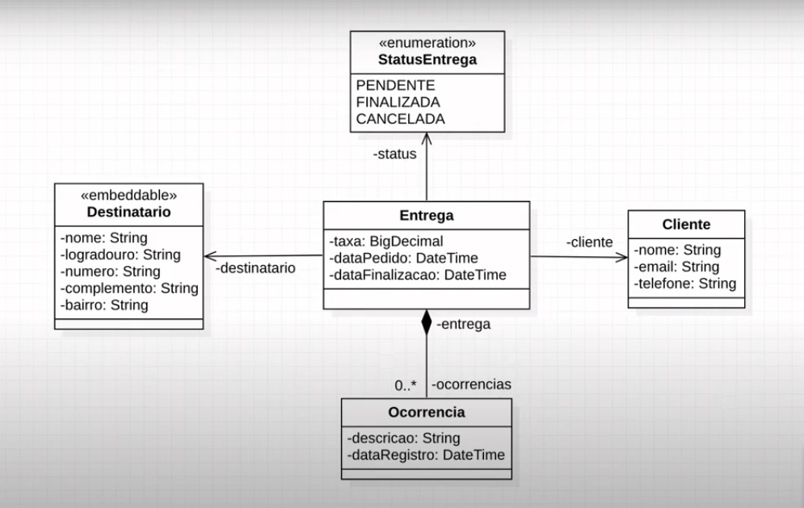

<h1 align="center">API Rest Pedidos</h1>

Projeto Back-end de uma API Rest, conectando com o banco de dados MySQL. 
Requsições utilizando os principais métodos HTTP com  tratativa de alguns possíveis erros.

<h1 align="center">
  
</h1>
 
### 🛠 Tecnologias:

As seguintes ferramentas foram usadas na construção do projeto:

### 💻 Demostração do Diagrama de Classe:

### 📝 Fases do projeto: 

- [x] Criar projeto back-end 
- [x] Criar projeto Spring Boot no Spring Initializr com as seguintes dependências:
    -	Web
    -	JPA
    -	H2
    -	Security
- [x] Implementar o back end
- [x] Acesso a banco de dados H2
- [x] Criar endpoints da API REST

---

### 🔗 Links usados durante o projeto:

 - [Spring Initializr](https://start.spring.io/)
 
---

### 👩🏽‍💻 Autor:

Projeto realizado por Rafael Alves Teixeira com a orientação do professor Nelio do canal DevSuperior.

